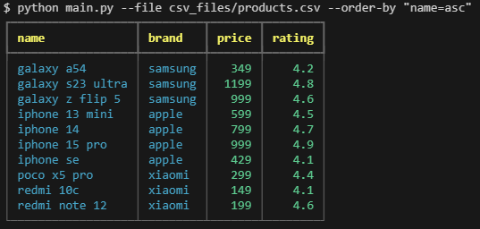
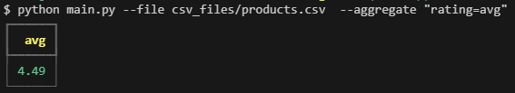
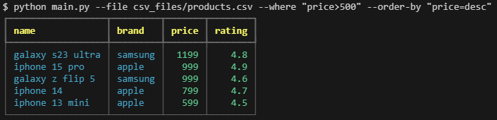
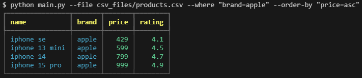

## Этот скрипт - решение тестового задания на вакансию python dev компании WorkMate

### Скрипт позволяет выводить содержание CSV файлов в необработанном и обработанном виде  в окне терминала.

    требуется python 3.10 или выше, так как используется TypeAlias, который появился тольков начиная с 3.10

    Скрип выполнен с учетом возможности быстрого добавления нового функционала:
    Для добавления новой комманды достаточно создать новый класс процесссора,
    новый обработчик аргументов коммандной строки(CLI feature) и зарегистрировать в main
    Это соответствует Open/Closed principle: сущности должны быть открыты для дополнения но не для модификаций. При этом основная логика в CSVApplication остается неизменной.

### Реализованы следующие паттерны:

    Абстрактные базовые классы:
    Использование ABC позволяет делать архитектуру приложения открытой

    Стратегия:
    DataProcessor определяет интерфейс, WhereProcessor, OrderByProcessor и AggregateProcessor применяют этот интерфейс. Основное CSVApplication использует список процессоров без указания каких именно.

    Фабрика:
    Абстрактный класс CliFeature и его наследники являются фабриками, что позволяет на выходе иметь экземпляр класса DataProcessor

### Реализованы следующие SOLID принципы ООП:

    Single responsibility:
        у каждого класса своя конкретная задача

    Open/closed principle:
        для добавления функционала достаточно добавить соотв классы и прописать их в списке(см. выше)

    Liskov substitution principle:
        наследники класса используют родительские методы

    Interface segregation:
        использование множества отдельных классов, каждый компонент имеет свой интерфейс

    Dependency inversion:
        несколько уровней абстракций, например CSVApplication не зависит от CSVDataloader напрямую, вместо этого зависит от абстракции, а экземпляр уже встраивается в CSVApplication

### Использованные библиотеки:

    парсинг аргументов: argparse

    обработка данных: стандартные библиотеки: re, statistics, operator

    вывод в консоль: для красивого вывода в терминале использована библ rich

    тестирование: pytest, unittest

### Функционал(примеры комманд):

    --file products.csv	(обязательный) Путь к файлу для вывода.

    --where "column>value"	Фильтрация с помощью операторов: =, >, <

    --order-by "column=direction"	Сортирует данные по столбцу asc(возрастание) или desc(убывание).

    --aggregate "column=function"	Агрегирует выводя  min, max, или avg.

### Примеры(скринщоты):

### Дополнительно

    В коде мспользуется английский язык, при необходимости можно изменить выводж сообщений на русском или добавить настройку

    Также в коде используются упрощенные докстринги( при необходимости их можно дополнить аргументами, выводом и так далее)

    В коде используется типизация